# Gemma 4 Knowledge Graph

This document provides a structured knowledge graph of the Gemma 4 model family using Mermaid diagrams and tabular relationship maps.

---

## 1. Family Hierarchy

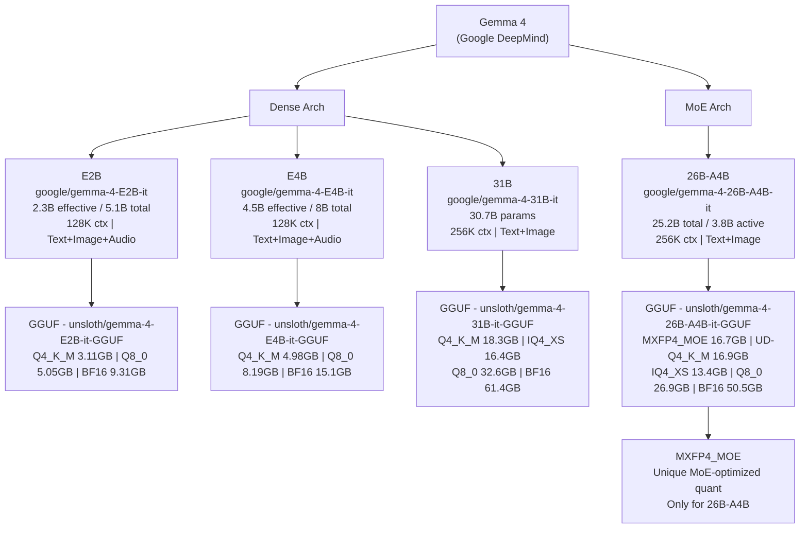

---

## 1b. Backend Ecosystem

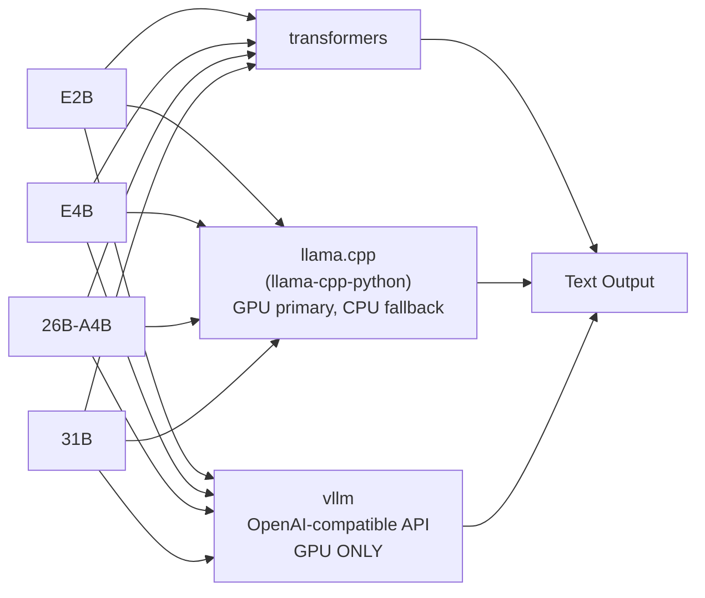

---

## 1c. Toolkit Scripts

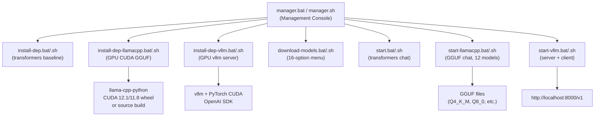

---

## 2. Architecture Components

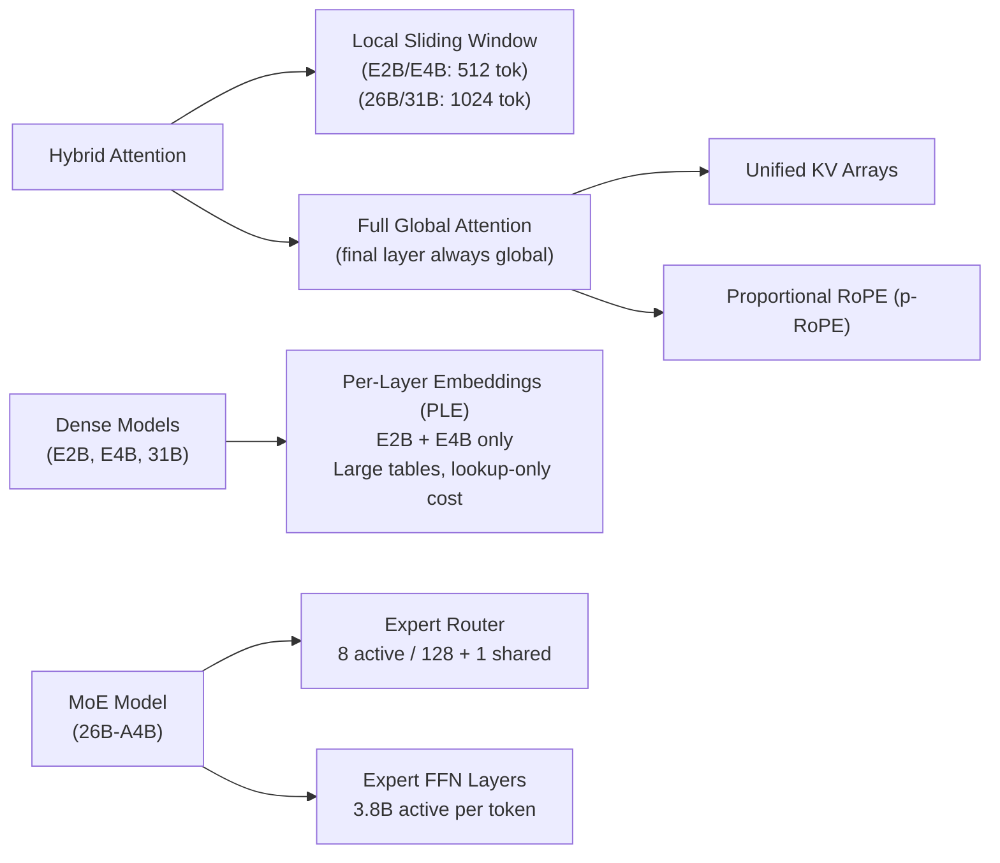

---

## 3. Modality Graph

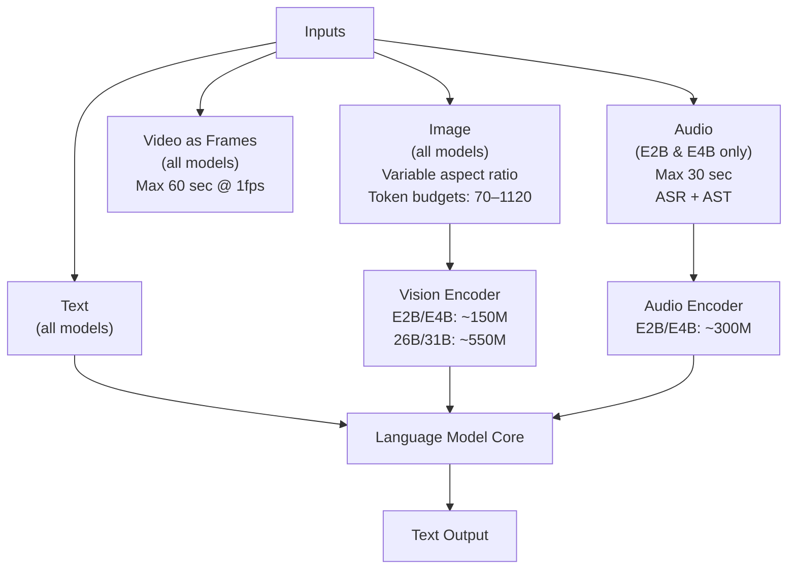

---

## 4. Thinking Mode State Machine

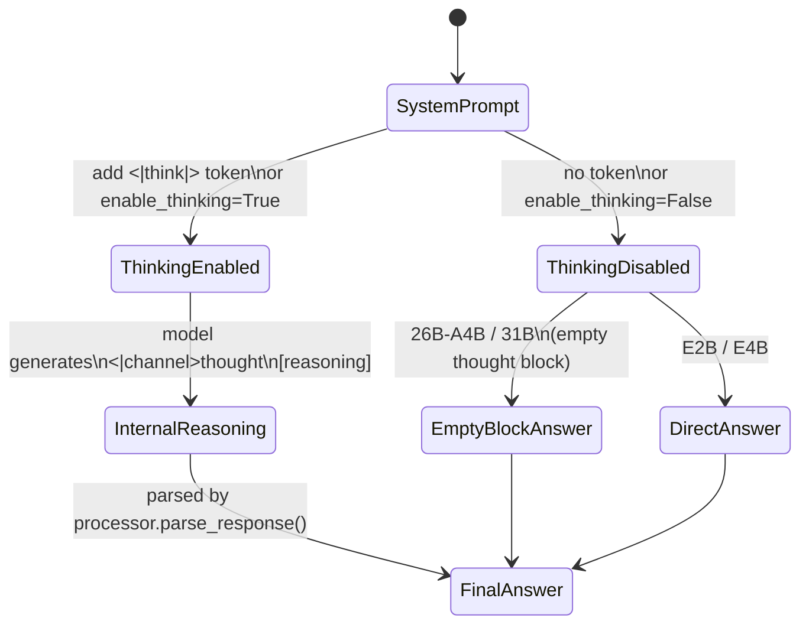

---

## 5. Deployment Decision Tree

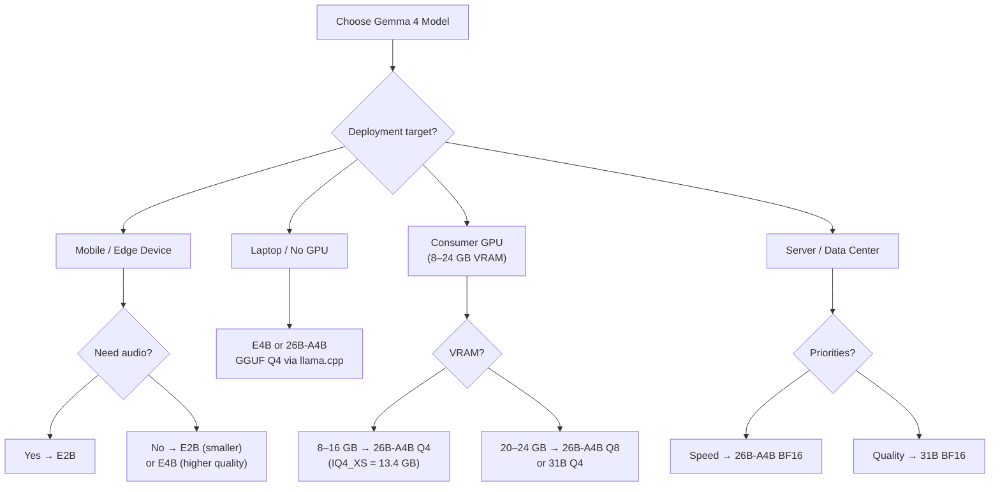

---

## 6. Capability Coverage Map

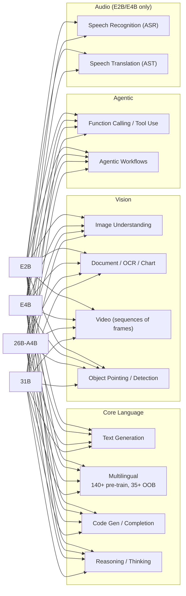

---

## 7. Benchmark Relationships

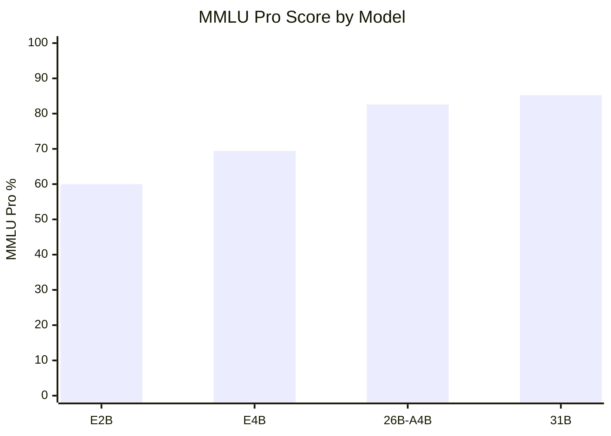

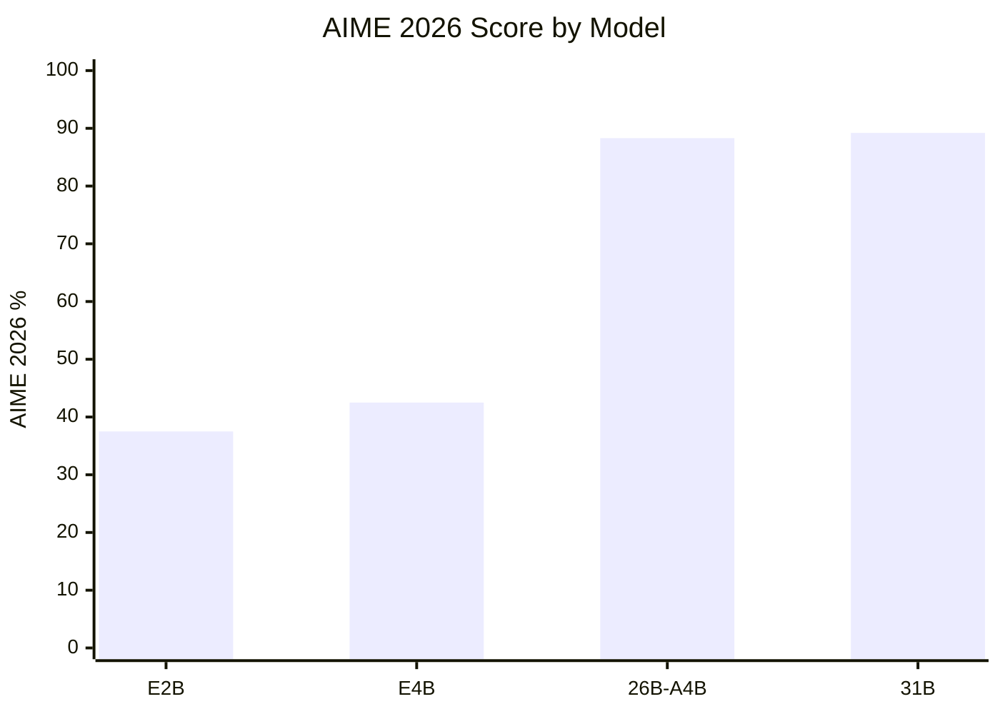

---

## 8. Entity Relationship Map (Textual)

| Entity | Relationship | Target Entity |
|---|---|---|
| Gemma 4 | is_family_of | E2B, E4B, 26B-A4B, 31B |
| E2B | has_architecture | Dense + PLE |
| E4B | has_architecture | Dense + PLE |
| 26B-A4B | has_architecture | Mixture-of-Experts |
| 31B | has_architecture | Dense |
| E2B, E4B | supports_modality | Text, Image, Video, Audio |
| 26B-A4B, 31B | supports_modality | Text, Image, Video |
| all_models | uses_mechanism | Hybrid Attention |
| Hybrid Attention | consists_of | Sliding Window + Global |
| Global Attention | uses | Unified KV + p-RoPE |
| E2B, E4B | uses_feature | PLE (Per-Layer Embeddings) |
| 26B-A4B | uses_feature | Expert Router (8/128+1) |
| 26B-A4B | has_gguf | unsloth/gemma-4-26B-A4B-it-GGUF |
| unsloth GGUF | supports_quant | Q2 to BF16 |
| all_models | supports_feature | Thinking Mode |
| all_models | supports_feature | Function Calling |
| all_models | trained_with | transformers + accelerate |
| all_models | license | Apache 2.0 |
| Google DeepMind | created | Gemma 4 |
| E2B_vision_encoder | param_count | ~150M |
| E4B_vision_encoder | param_count | ~150M |
| 26B_vision_encoder | param_count | ~550M |
| 31B_vision_encoder | param_count | ~550M |
| E2B_audio_encoder | param_count | ~300M |
| E4B_audio_encoder | param_count | ~300M |

---

## 9. Software Dependency Graph

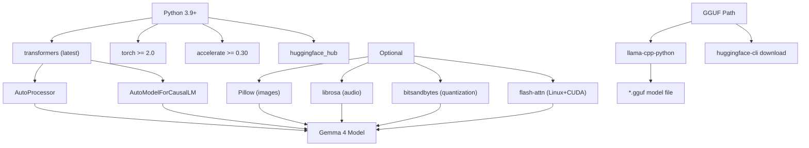

---

## 10. Parameter Scale Visualization

```
Model       Effective Params    Total Params      Context
━━━━━━━━━━━━━━━━━━━━━━━━━━━━━━━━━━━━━━━━━━━━━━━━━━━━━━━━
E2B         2.3B  [██░░░░░░░░]  5.1B (total)     128K
E4B         4.5B  [████░░░░░░]  8.0B (total)     128K
26B-A4B     3.8B* [███░░░░░░░]  25.2B (total)    256K  ← MoE: 3.8B active
31B         30.7B [██████████]  30.7B (total)    256K
━━━━━━━━━━━━━━━━━━━━━━━━━━━━━━━━━━━━━━━━━━━━━━━━━━━━━━━━
* = active params per forward pass (MoE)
```

---

## Quick Reference Card

| | E2B | E4B | 26B-A4B | 31B |
|---|:---:|:---:|:---:|:---:|
| Params (effective) | 2.3B | 4.5B | 3.8B active | 30.7B |
| Context | 128K | 128K | 256K | 256K |
| Audio | ✅ | ✅ | ❌ | ❌ |
| Speed rank | 1st | 2nd | 3rd | 4th |
| Quality rank | 4th | 3rd | 2nd | 1st |
| VRAM (full) | 8 GB | 12 GB | 32 GB | 48 GB+ |
| VRAM (Q4 GGUF) | ~5 GB | ~8 GB | ~17 GB | ~20 GB |
| On-device | ✅ | ✅ | ❌ | ❌ |
